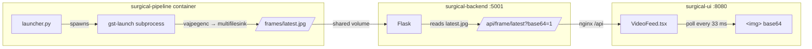
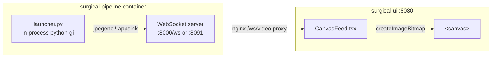

# Integrating appsink → WebSocket → canvas into the production UI

How to move the low-latency preview (proven in this PoC) into the real
Surgical Instrument app, replacing the current file-polling video path.

---

## 1. Current architecture



**Latency sources to remove:** disk write+read, 33 ms poll gap, base64 bloat,
`` re-render.

---

## 2. Target architecture



Key change: the pipeline runs **in-process** (python-gi) so `appsink` can hand
JPEG bytes straight to a WebSocket broadcaster — no disk, no polling. Detection
latency is unchanged (encode is after `gvadetect`).

---

## 3. Component changes (checklist)

### T-A. `pipeline/pipeline_string.py` — add an appsink sink option
Add a `sink="appsink"` branch (keep `multifilesink` as default/fallback).

Current render tail (approx):
```
… gvawatermark ! … ! vajpegenc quality=90 ! multifilesink location=/frames/latest.jpg …
```

New appsink tail (software `jpegenc`, since `vajpegenc` isn't in the image):
```
… gvawatermark ! vapostproc ! video/x-raw ! jpegenc quality=80 !
  appsink name=uisink emit-signals=true max-buffers=1 drop=true sync=false
```

- The **source segments (file / basler) do NOT change** — only the tail.
- Optionally keep BOTH outputs with a `tee` (file for recording + appsink for
  UI) during migration.

### T-B. `pipeline/launcher.py` — run the pipeline in-process + WS server
Replace `subprocess.Popen(gst-launch …)` with:
1. `Gst.parse_launch(pipeline_string)` (build in-process).
2. Get `uisink = pipeline.get_by_name("uisink")`, connect `new-sample`.
3. Run an asyncio WebSocket server in a background thread (see PoC
   [`server.py`](server.py) — the `appsink` callback + broadcaster + `websockets.serve`).
4. Keep the existing `/start`, `/stop`, supervisor, respawn logic.

For **basler**: keep `basler_reader.py` as a subprocess, but wire its stdout to
`fdsrc` **in-process**:
```python
proc = subprocess.Popen([...basler_reader...], stdout=subprocess.PIPE)
fdsrc = pipeline.get_by_name("src")
fdsrc.set_property("fd", proc.stdout.fileno())
```
(For **file** the pipeline is fully self-contained — no subprocess.)

### T-C. `pipeline/Dockerfile` — add the WebSocket dep
```dockerfile
RUN pip install --no-cache-dir websockets==12.0
```
(PoC installs it at runtime; production should bake it in.)

### T-D. `docker-compose.yaml` — expose the WS port on the pipeline service
The pipeline already runs a control plane on `:8000`. Either:
- serve the WS on a new port (e.g. `8091`) on `surgical-pipeline`, or
- add a `/ws` route on the existing `:8000`.
No host `ports:` needed — nginx reaches it on the internal network.

### T-E. `ui/nginx.conf` — proxy the WebSocket
Add a location that proxies to the pipeline WS with the required `Upgrade`
headers (the existing `/api/` block already has `proxy_buffering off` + long
timeouts, but WS needs the upgrade headers):
```nginx
location /ws/video {
    proxy_pass         http://surgical-pipeline:8091;   # or :8000/ws
    proxy_http_version 1.1;
    proxy_set_header   Upgrade    $http_upgrade;
    proxy_set_header   Connection "upgrade";
    proxy_set_header   Host       $host;
    proxy_read_timeout 3600s;
    proxy_buffering    off;
}
```

### T-F. UI — swap polling for a canvas WebSocket client
- Add `CanvasFeed.tsx` (from PoC [`client.html`](client.html) logic): open
  `new WebSocket(\`ws://${location.host}/ws/video\`)`, `binaryType='arraybuffer'`,
  on message `createImageBitmap` → `ctx.drawImage` on a `<canvas>`.
- Replace `<VideoFeed>` (base64 poll) with `<CanvasFeed>` in the detection panel.
- `ui/src/services/api.ts`: expose the WS URL (`/ws/video`) instead of the
  frame-poll URL.
- Delete the `/frame/latest` poll loop once cut over.

### T-G. (optional cleanup) backend
Once the UI no longer polls, the backend `/api/frame/latest` and
`/api/video_feed` endpoints + the `latest.jpg` reader become dead code (TODO
T3). Remove after the UI cutover is verified.

---

## 4. filesrc vs Basler pipeline changes

**Only the sink tail changes; the source stays as-is.** The appsink tail is
identical for both.

| | filesrc | basler |
|---|---|---|
| Source segment | `filesrc ! qtdemux ! h264parse ! vah264dec ! VAMemory ! identity sync=true` | `fdsrc fd=<pipe> ! rawvideoparse ! vapostproc ! VAMemory,NV12` |
| Runs in-process? | fully (Gst.parse_launch) | pipeline in-process **+** `basler_reader.py` subprocess feeding `fdsrc` fd |
| Pacing | `identity sync=true` (real-time) | camera is the clock (self-paced) |
| Tail (same for both) | `… gvawatermark ! vapostproc ! video/x-raw ! jpegenc ! appsink` | same |

So the changes required:
- **filesrc**: none to the source; swap `multifilesink` tail → `appsink` tail.
- **basler**: none to the source elements; swap tail → `appsink`; and in
  `launcher.py` wire the `basler_reader.py` subprocess stdout to the in-process
  `fdsrc` fd (instead of piping to a `gst-launch` subprocess).

---

## 5. WebSocket vs the current MJPEG endpoint

The backend already has an `/api/video_feed` MJPEG endpoint. If a full
in-process rewrite (T-B) is too big a first step, a **smaller** intermediate
win keeps the file path but streams push-style:
- UI uses `` (browser auto-updates the multipart
  stream) instead of base64 polling → removes the 33 ms poll + base64 (~30 ms).
- No pipeline/launcher change. Latency ~25–50 ms (vs ~15–35 ms for appsink+WS).

Recommended path: ship the MJPEG-`` quick win first (UI-only), then do the
appsink+WS rewrite for the lowest latency.

---

## 6. Migration & rollback

1. **Phase 0 (done):** standalone PoC in `appsink_ws_demo/` — validated 60 fps.
2. **Phase 1:** add the `appsink` tail behind a flag (`SINK=appsink`) with `tee`
   so `multifilesink` still writes the file (old UI keeps working).
3. **Phase 2:** add the WS server + nginx route; add `CanvasFeed` alongside the
   old `VideoFeed` behind a UI toggle.
4. **Phase 3:** default to canvas; keep polling as fallback.
5. **Phase 4:** remove the file path + dead backend endpoints (TODO T3).

Rollback at any phase = flip the flag/toggle back to the file path.

---

## 7. Testing

- **Frame flow:** `appsink` stats show ~60 fps (as in the PoC log).
- **WS reachable through nginx:** browser console — `new WebSocket('ws://<host>:8080/ws/video')` connects.
- **Latency:** add a JS timestamp overlay (send capture ts alongside the frame,
  compare on draw) to measure WS→canvas ms.
- **Load:** multiple browser tabs = multiple WS clients; confirm fps holds.
- **Failure modes:** kill/restart pipeline → WS reconnects (client has retry);
  UI shows disconnected state.

---

## 8. Honest latency ceiling

Even fully integrated, the browser canvas will be **~15–35 ms** behind the
camera — always slower than the native `glimagesink` (~12 ms). Architecture
guidance:
- **Native GL sink** → surgeon's primary OR monitor (lowest latency).
- **Browser (appsink→WS→canvas)** → monitoring / KPIs / remote view.
