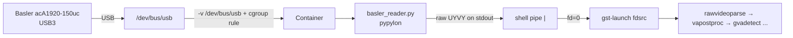

# Basler Live Pipeline — How It Works

Live polyp detection from a Basler USB3 camera, running on the Intel iGPU via
DLStreamer + OpenVINO. Driven by [`run_basler_pipeline.sh`](run_basler_pipeline.sh).

---

## 1. Why a Python bridge (no `gencamsrc`)

The DLStreamer 2026.1 image does **not** ship the Basler GStreamer plugins
(`gencamsrc` / `pylonsrc`) — verified with `gst-inspect-1.0`. Installing
Basler's Debian SDK bloats the image ~150 MB behind a registration wall.

Instead we bridge the camera with **pypylon** (already in the image):
[`pipeline/basler_reader.py`](pipeline/basler_reader.py) opens the USB camera,
configures it, grabs frames, and writes **raw bytes to stdout**. A shell pipe
feeds that stdout into `gst-launch`'s `fdsrc fd=0`.

```
basler_reader.py (pypylon) ──stdout──▶ | ──stdin(fd=0)──▶ gst-launch fdsrc
```

This is zero-dependency and portable (vs `shmsink` control sockets or a
`v4l2loopback` kernel module we don't own on customer hardware).

---

## 2. Connection chain



Container access flags in the `docker run`:

| Flag | Purpose |
|------|---------|
| `-v /dev/bus/usb:/dev/bus/usb` | expose USB device nodes |
| `--device-cgroup-rule='c 189:* rmw'` | allow USB (major 189) access |
| `--device /dev/dri:/dev/dri` | reach the Intel GPU |
| `--group-add render/video` | GPU permission groups |
| `-e DISPLAY -v /tmp/.X11-unix` | X server (display mode only) |

---

## 3. The pipeline, element by element

```
basler_reader.py --geometry 1920x1080@60 --pixel-format uyvy
  | gst-launch-1.0
    fdsrc fd=0 blocksize=4147200 do-timestamp=true
    ! rawvideoparse format=yuy2 width=1920 height=1080 framerate=60/1
    ! vapostproc ! "video/x-raw(memory:VAMemory),format=NV12"
    ! identity
    ! queue max-size-buffers=1 max-size-bytes=0 max-size-time=16000000 leaky=downstream
    ! gvadetect model=best.xml device=GPU threshold=0.5 \
        pre-process-backend=va-surface-sharing nireq=1 ie-config=PERFORMANCE_HINT=LATENCY
    ! queue max-size-buffers=1 max-size-bytes=0 max-size-time=16000000 leaky=downstream
    ! gvawatermark
    ! vapostproc
    ! autovideosink sync=false
```

The benchmark script uses `identity eos-after=FRAMES` so test runs stop cleanly.
The production app uses plain `identity` so the live camera runs continuously.

| Element / stage | What it does | Why it is in the pipeline |
|-----------------|--------------|---------------------------|
| `basler_reader.py --geometry 1920x1080@60 --pixel-format uyvy` | Opens the Basler camera with pypylon, configures 1080p60, and writes raw UYVY bytes to stdout. | DLStreamer image does not include `gencamsrc`/`pylonsrc`; pypylon gives a portable camera bridge without installing the full Basler SDK. `uyvy` uses camera-native `YCbCr422_8`, avoiding pylon software BGR conversion. |
| `fdsrc fd=0 blocksize=4147200 do-timestamp=true` | Reads raw frames from stdin, one 1920×1080×2-byte frame per buffer. `do-timestamp=true` timestamps buffers when `fdsrc` receives them. | Connects the Python camera bridge to GStreamer. The blocksize prevents partial-frame buffers. The timestamp is the start point for `fdsrc -> sink` latency tracing. |
| `rawvideoparse format=yuy2 width=1920 height=1080 framerate=60/1` | Tells GStreamer how to interpret the uncontainerized raw byte stream. | `fdsrc` only sees bytes; this element assigns format, resolution, and framerate so downstream video elements can negotiate caps. This build displays correctly with `format=yuy2`; `format=uyvy` produced green/corrupt output. |
| `vapostproc` | Uses VAAPI/iGPU media hardware to convert the parsed 4:2:2 camera frame. | Hardware color conversion is much faster and more deterministic than software `videoconvert` before inference. |
| `"video/x-raw(memory:VAMemory),format=NV12"` | Caps filter forcing output to NV12 in VA GPU memory. | Keeps frames on the GPU path and provides the surface type `gvadetect` can use with `va-surface-sharing`. This avoids a CPU copy before inference. |
| `identity` / `identity eos-after=FRAMES` | Pass-through element; in benchmark mode can stop after N frames. | Production keeps a stable named stage with no pacing or buffering. Benchmark mode uses `eos-after=3000` for repeatable measurement windows. |
| First `queue max-size-buffers=1 max-size-bytes=0 max-size-time=16000000 leaky=downstream` | Small boundary before inference; holds at most one frame or ~16 ms at 60 fps, and drops stale frames if downstream is late. | Prevents camera-to-screen latency from growing when inference or display briefly stalls. `leaky=downstream` implements freshest-frame-wins, which is correct for a live surgical feed. |
| `gvadetect model=... device=GPU threshold=0.5` | Runs YOLO/OpenVINO object detection and attaches ROI metadata to the frame. | This is the polyp-detection stage. `device=GPU` uses the iGPU; `threshold=0.5` filters detections. |
| `pre-process-backend=va-surface-sharing` | Lets DLStreamer/OpenVINO consume VA surfaces directly. | Avoids copying GPU frames back to system memory for preprocessing. This was the fastest path in our measurements. |
| `nireq=1` | Uses one inference request in flight. | Optimizes latency rather than throughput. Multiple requests can increase FPS, but they add in-flight buffering and worsen camera-to-screen latency. |
| `ie-config=PERFORMANCE_HINT=LATENCY` | Passes OpenVINO latency-oriented scheduling hint. | Tells the runtime to prefer low latency over maximum throughput. |
| Second `queue max-size-buffers=1 ... leaky=downstream` | Small boundary after detection and before rendering/display. | Prevents display-side stalls from back-pressuring inference and building up old frames. This queue is especially important if the sink or desktop compositor is slow. |
| `gvawatermark` | Draws detection boxes/labels onto the frame using ROI metadata from `gvadetect`. | Produces the annotated video shown on the display. It is very cheap in our traces (~0.05 ms mean). |
| `gvafpscounter interval=1` (full path only) | Prints FPS once per second. | Useful for operator/debug visibility. Removed in `PIPELINE_MINIMAL_DISPLAY=1` because it is not needed for the lowest-latency display path. |
| Second `vapostproc` | Bridges the annotated GPU/VA surface to the display sink. | A direct `gvawatermark ! sink` path fails negotiation on this stack. `vapostproc` performs the needed format/memory adaptation. |
| `"video/x-raw"` (full/RDP path only) | Caps filter forcing system-memory raw video. | Needed by software sinks such as `ximagesink` and by the full compatibility path. Removed in minimal real-monitor mode to avoid unnecessary download/caps work. |
| `videoconvert` (full/RDP path only) | Software color conversion before display. | Required by some software X sinks. It is removed in minimal mode for hardware/`autovideosink` display because it adds avoidable work. |
| `autovideosink sync=false` | Creates the native display window and lets GStreamer choose the best available video sink. `sync=false` renders frames immediately. | This is the camera-to-screen output path. `sync=false` avoids clock throttling/queuing for a live camera; the camera already self-paces at 60 fps. |
| `fakesink sync=false async=false` (measure mode) | Consumes frames without displaying. | Used to measure pipeline compute without display/compositor effects. |
| `jpegenc ! avimux ! filesink` (record mode) | Encodes annotated frames and writes an AVI file. | Used only for recording validation clips; not used in latency-critical display mode. |

**Why it's fast** — almost everything stays on the GPU, zero copies:
```
camera FPGA(UYVY) → GPU vapostproc(NV12) → GPU zero-copy → GPU inference
```

**Why it is deterministic** — the live path bounds buffering:
```
one-frame leaky queue → single inference request → one-frame leaky queue → immediate display
```

---

## 4. Three modes (env toggles)

| Command | Sink | Use |
|---------|------|-----|
| `bash run_basler_pipeline.sh` | `fakesink sync=false` | **measure** latency (+ trace) |
| `RECORD=1 bash run_basler_pipeline.sh` | `… ! jpegenc ! avimux ! filesink` | **record** annotated `videos/basler_output.avi` |
| `DISPLAY_VIEW=1 bash run_basler_pipeline.sh` | `… ! ximagesink` | **live window** (run from RDP/desktop GUI) |

`RECORD` and `DISPLAY_VIEW` add `vapostproc ! video/x-raw ! videoconvert`
first, because JPEG/X11 sinks can't read GPU VA surfaces — only `fakesink`
accepts them directly.

### Options (env vars)

| Var | Default | Meaning |
|-----|---------|---------|
| `SERIAL` | first camera | pick a specific camera serial |
| `W` / `H` / `FPS` | 1920 / 1080 / 60 | geometry |
| `FRAMES` | 3000 | stop after N frames |
| `NIREQ` | 1 | inference requests in flight |
| `LEAKY` | 0 | 1 → `leaky=downstream max-size-buffers=1 max-size-time=16000000` (newest-frame-wins; bounds latency under a slow sink) |
| `RECORD` | 0 | 1 → save `.avi` |
| `DISPLAY_VIEW` | 0 | 1 → live window |
| `VSINK` | `ximagesink` | display sink (RDP-safe default) |
| `OUT_AVI` | `/videos/basler_output.avi` | record path (container-side) |

Every run prints a per-element table plus:
- `compute critical path (gva* sum)` — inference + watermark only.
- `E2E PIPELINE (fdsrc->fakesink)` in MEASURE mode, or
  `CAMERA-TO-SCREEN (fdsrc->display)` in DISPLAY mode (the sink is a real display).

Examples:
```bash
# Measure pipeline latency (fakesink)
bash run_basler_pipeline.sh

# Live view, freshest-frame-wins (recommended for a live feed)
DISPLAY_VIEW=1 LEAKY=1 FRAMES=3000 bash run_basler_pipeline.sh

# Live view, keep every frame (shows backlog under a slow RDP sink)
DISPLAY_VIEW=1 LEAKY=0 FRAMES=3000 bash run_basler_pipeline.sh

# Record an annotated clip
SERIAL=40067928 RECORD=1 FRAMES=1200 bash run_basler_pipeline.sh
```

### Live display commands + results

Two commands produce a live window with detection boxes (run from the RDP /
desktop GUI terminal). Both use `LEAKY=1` (freshest-frame-wins) and let
`autovideosink` pick a hardware sink.

**1. Full path** (keeps `gvafpscounter` + GPU→system download):

```bash
VSINK=autovideosink DISPLAY_VIEW=1 LEAKY=1 bash run_basler_pipeline.sh
```

Generated pipeline:

```bash
python3 /opt/basler_reader.py --geometry 1920x1080@60 --pixel-format uyvy \
  | gst-launch-1.0 \
    fdsrc fd=0 blocksize=4147200 do-timestamp=true ! \
    rawvideoparse format=yuy2 width=1920 height=1080 framerate=60/1 ! \
    vapostproc ! "video/x-raw(memory:VAMemory),format=NV12" ! \
    identity eos-after=3000 ! \
    queue max-size-buffers=1 max-size-bytes=0 max-size-time=16000000 leaky=downstream ! \
    gvadetect model=/models/yolo11n_polyp/best_openvino_model/best.xml device=GPU threshold=0.5 \
      pre-process-backend=va-surface-sharing nireq=1 ie-config=PERFORMANCE_HINT=LATENCY ! \
    queue max-size-buffers=1 max-size-bytes=0 max-size-time=16000000 leaky=downstream ! \
    gvawatermark ! gvafpscounter interval=1 ! \
    vapostproc ! "video/x-raw" ! videoconvert ! autovideosink sync=false
```

Result:

```
element               samples   mean_ms   p99_ms
------------------------------------------------
gvadetect0               2920    10.315   15.359 *
gvawatermarkimpl0        2999     0.054    0.123 *
gvafpscounter0           2999     0.024    0.068 *
rawvideoparse0           3000     3.960    6.320
vapostproc0              3000     4.328    6.152
videoconvert0            2999     0.010    0.032
------------------------------------------------
compute critical path (gva* sum)          10.393 ms
CAMERA-TO-SCREEN (fdsrc->display) mean    12.910 ms
CAMERA-TO-SCREEN (fdsrc->display) p50/p99   16.41 / 20.37 ms
```

**2. Minimal path** (`MINIMAL=1` — drops `gvafpscounter` + `videoconvert`, keeps
one `vapostproc` bridge; a bare `gvawatermark ! sink` fails `not-negotiated`):

```bash
MINIMAL=1 VSINK=autovideosink DISPLAY_VIEW=1 LEAKY=1 bash run_basler_pipeline.sh
```

Generated pipeline:

```bash
python3 /opt/basler_reader.py --geometry 1920x1080@60 --pixel-format uyvy \
  | gst-launch-1.0 \
    fdsrc fd=0 blocksize=4147200 do-timestamp=true ! \
    rawvideoparse format=yuy2 width=1920 height=1080 framerate=60/1 ! \
    vapostproc ! "video/x-raw(memory:VAMemory),format=NV12" ! \
    identity eos-after=3000 ! \
    queue max-size-buffers=1 max-size-bytes=0 max-size-time=16000000 leaky=downstream ! \
    gvadetect model=/models/yolo11n_polyp/best_openvino_model/best.xml device=GPU threshold=0.5 \
      pre-process-backend=va-surface-sharing nireq=1 ie-config=PERFORMANCE_HINT=LATENCY ! \
    queue max-size-buffers=1 max-size-bytes=0 max-size-time=16000000 leaky=downstream ! \
    gvawatermark ! vapostproc ! autovideosink sync=false
```

Result:

```
element               samples   mean_ms   p99_ms
------------------------------------------------
gvadetect0               2908    10.265   15.022 *
gvawatermarkimpl0        2999     0.058    0.137 *
vapostproc0              3000     2.599    4.747
vapostproc1              2999     0.029    0.085
------------------------------------------------
compute critical path (gva* sum)          10.323 ms
CAMERA-TO-SCREEN (fdsrc->display) mean    12.634 ms
CAMERA-TO-SCREEN (fdsrc->display) p50/p99   13.73 / 17.89 ms
```

**Comparison**

| Command | camera-to-screen mean | p99 | note |
|---------|----------------------:|----:|------|
| Full (`autovideosink`) | 12.910 ms | 20.37 | keeps fpscounter + videoconvert |
| **Minimal (`MINIMAL=1`)** | **12.634 ms** | **17.89** | leanest; slightly lower + tighter p99 |

> Over RDP with software `ximagesink` the same run is ~33 ms (the extra ~12 ms
> is `videoconvert` for the software sink). A hardware sink removes it.
> Use `MINIMAL=1` on a real monitor; keep the default (full) path for RDP
> `ximagesink`.

---

## 5. Latency (measured)

Three numbers matter, at increasing scope:

| Metric | Value | Scope |
|--------|------:|-------|
| Model inference (`benchmark_app`) | **4.46 ms** / 224 FPS | model only, no GStreamer |
| Compute critical path (`gva*` sum) | **~11 ms** | inference + watermark |
| E2E pipeline (`fdsrc → fakesink`) | **~13–16 ms** | whole graph, no display |

Per-element (MEASURE mode, camera self-paced, `flags=pipeline+element`):

| Stage | mean ms | note |
|-------|--------:|------|
| rawvideoparse0 | ~2–4 | camera frame arrival (pacing, **not** compute) |
| vapostproc0 (UYVY→NV12) | ~2–3 | real per-frame GPU input convert |
| gvadetect0 | ~8–11 | preprocess + inference + YOLO parse |
| gvawatermark | ~0.05 | cheap (few boxes in bench scene) |

### Leaky vs non-leaky — DISPLAY mode over RDP (3000 frames)

`leaky=downstream` (`LEAKY=1`) drops stale frames instead of letting them pile
up behind a slow sink. Measured with the live camera → `ximagesink` over RDP:

| Metric | `LEAKY=0` | `LEAKY=1` | Δ |
|--------|----------:|----------:|----:|
| **camera-to-screen mean** | **72.30 ms** | **33.03 ms** | **−54 %** |
| camera-to-screen p50 | 68.71 | 34.71 | −49 % |
| camera-to-screen p99 | 110.19 | 43.95 | −60 % |
| `queue1` (pre-sink backlog) | 40.77 | 8.01 | frames dropped, not queued |
| `queue0` | 12.59 | 0.08 | relieved |

**Takeaway:** for a **live feed**, `LEAKY=1` is the correct choice — it roughly
**halves** camera-to-screen latency and tames the p99, at the cost of dropping
stale frames (freshest-frame-wins). For pure **throughput/measurement** (process
every frame) leave `LEAKY=0`.

> Of the ~33 ms leaky camera-to-screen, ~12 ms is `videoconvert` (NV12→RGB for
> **software** `ximagesink`) — an **RDP-only** cost. On a real HDMI monitor with
> a hardware/GL sink that ~12 ms + the network path largely vanish, so
> camera-to-screen drops toward ~20 ms (still excluding sensor exposure + USB).

### What these numbers do NOT include (glass-to-glass)

The GStreamer tracer measures `fdsrc → sink` only. **True camera-to-screen
(glass-to-glass) also includes** the sensor exposure/readout (~8–16 ms) and
USB3 transfer (before `fdsrc`), plus the physical panel scanout (after the
sink). Full glass-to-glass on a real monitor is therefore ~**35–50 ms**
(consistent with the 39–55 ms medical-endoscope reference). Measuring that
requires a physical **LED + high-speed-camera** test, not this tracer.

---

## 6. Production app path and run commands

Production ([`pipeline/pipeline_string.py`](../pipeline/pipeline_string.py),
source kind `basler`) uses the same pypylon bridge + GPU path, driven by
[`pipeline/launcher.py`](../pipeline/launcher.py) inside the
`surgical-pipeline` container. `run_basler_pipeline.sh` is the standalone
benchmark/record/live-view version; the app stack uses `make up` / `make run`.

### Changes added for deterministic low latency

The production app now supports the same low-latency display path plus optional
determinism controls:

| Change | Control | Default | Purpose |
|--------|---------|---------|---------|
| Minimal display tail | `PIPELINE_MINIMAL_DISPLAY=1` | `0` | Uses `gvawatermark ! vapostproc ! autovideosink`, matching the best measured path. |
| Fixed camera mode | `BASLER_FIXED_CAMERA=1` | `0` | Disables auto exposure/gain/white-balance for lower timing variance. |
| Fixed exposure | `BASLER_EXPOSURE_US=5000` | unset | Sets `ExposureTime`/`ExposureTimeAbs` in microseconds. |
| Fixed gain | `BASLER_GAIN=0` | unset | Sets `Gain`/`GainRaw`. |
| Camera CPU affinity | `PIPELINE_CAMERA_CORES=2` | unset | Runs `basler_reader.py` under `taskset`. |
| GStreamer CPU affinity | `PIPELINE_GST_CORES=3-7` | unset | Runs `gst-launch-1.0` under `taskset`. |
| Camera RT priority | `PIPELINE_CAMERA_RT_PRIORITY=80` | unset | Runs camera process under `chrt -f`. |
| GStreamer RT priority | `PIPELINE_GST_RT_PRIORITY=70` | unset | Runs gst process under `chrt -f`. |

The compose service also grants real-time scheduling support for these modes:

```yaml
cap_add:
  - SYS_NICE
ulimits:
  rtprio: 99
  memlock: -1
  nice: -20
```

### Normal app run

Use this for the default production display path:

```bash
cd /home/intel/sachin/edge-ai-suites/health-and-life-sciences-ai-suite/Surgical_Instrument
DISPLAY=:0 make up
```

Subsequent runs can use:

```bash
DISPLAY=:0 make run
```

### Minimal display run

Use this to enable the lean display tail measured as the best GStreamer path:

```bash
DISPLAY=:0 make up PIPELINE_MINIMAL_DISPLAY=1
```

Generated Basler display pipeline:

```bash
python3 /opt/basler_reader.py --geometry 1920x1080@60 --pixel-format uyvy \
  | gst-launch-1.0 \
    fdsrc fd=0 blocksize=4147200 do-timestamp=true ! \
    rawvideoparse format=yuy2 width=1920 height=1080 framerate=60/1 ! \
    vapostproc ! "video/x-raw(memory:VAMemory),format=NV12" ! \
    identity ! \
    queue max-size-buffers=1 max-size-bytes=0 max-size-time=16000000 leaky=downstream ! \
    gvadetect model=/models/yolo11n_polyp/best_openvino_model/best.xml device=GPU threshold=0.5 \
      pre-process-backend=va-surface-sharing nireq=1 ie-config=PERFORMANCE_HINT=LATENCY ! \
    queue max-size-buffers=1 max-size-bytes=0 max-size-time=16000000 leaky=downstream ! \
    gvawatermark ! vapostproc ! autovideosink sync=false
```

Production uses `identity` instead of `identity eos-after=3000` so the live
camera runs continuously.

### Deterministic validation run

Use this when validating the hard latency requirement. It enables the minimal
display path, fixed camera controls, CPU affinity, and real-time priorities:

```bash
DISPLAY=:0 make up \
  PIPELINE_MINIMAL_DISPLAY=1 \
  BASLER_FIXED_CAMERA=1 \
  BASLER_EXPOSURE_US=5000 \
  BASLER_GAIN=0 \
  PIPELINE_CAMERA_CORES=2 \
  PIPELINE_GST_CORES=3-7 \
  PIPELINE_CAMERA_RT_PRIORITY=80 \
  PIPELINE_GST_RT_PRIORITY=70
```

If `chrt` is not available or the platform rejects real-time priority, keep the
fixed camera settings and CPU affinity but drop the RT priority flags:

```bash
DISPLAY=:0 make run \
  PIPELINE_MINIMAL_DISPLAY=1 \
  BASLER_FIXED_CAMERA=1 \
  BASLER_EXPOSURE_US=5000 \
  BASLER_GAIN=0 \
  PIPELINE_CAMERA_CORES=2 \
  PIPELINE_GST_CORES=3-7
```

### Verify the running app pipeline

Check the generated command and fixed camera mode:

```bash
docker logs surgical-pipeline 2>&1 \
  | grep -aE "generated cmd|fixed camera mode|taskset|chrt" \
  | tail -10
```

Expected deterministic command shape:

```bash
taskset -c 2 chrt -f 80 python3 /opt/basler_reader.py ...
taskset -c 3-7 chrt -f 70 gst-launch-1.0 ... ! gvawatermark ! vapostproc ! autovideosink sync=false
```

Expected fixed-camera log:

```text
[basler_reader] fixed camera mode: exposure=5000.0 µs, gain=0.00, trigger=off, acquisition=continuous
```

Check recent tracer statistics from container logs:

```bash
docker logs --tail 20000 surgical-pipeline 2>&1 | python3 -c 'import re,sys,statistics; vals=[]
for line in sys.stdin:
    if "latency," in line and "src-element=(string)fdsrc0" in line and "sink-element=(string)" in line:
        m=re.search(r"time=\(guint64\)([0-9]+)", line)
        if m: vals.append(int(m.group(1))/1e6)
vals=vals[-3000:]
if vals:
    s=sorted(vals); pct=lambda p: s[min(len(s)-1, int(p*len(s)))]
    print(f"samples={len(vals)} mean={statistics.mean(vals):.3f} ms p50={pct(.50):.3f} ms p95={pct(.95):.3f} ms p99={pct(.99):.3f} ms max={max(vals):.3f} ms")
else:
    print("no samples")'
```

Recent deterministic app result (`fdsrc -> autovideosink`, last 3000 samples):

```text
samples=3000 mean=12.779 ms p50=13.248 ms p95=16.160 ms p99=17.186 ms max=18.918 ms
```

This confirms the pipeline-side latency is stable and well below 50 ms. If
glass-to-glass latency still exceeds 50 ms, the remaining time is outside the
GStreamer tracer window: sensor exposure/readout and USB before `fdsrc`, plus
display scanout after the sink.

---

## 7. Troubleshooting

| Symptom | Cause | Fix |
|---------|-------|-----|
| `no element gencamsrc` | plugin not in image | expected — we use the pypylon bridge |
| Display "stuck", no window | `autovideosink` picks Xv/GL which fail over RDP | default `VSINK=ximagesink` (already set) |
| `DISPLAY is empty` | plain SSH shell | run from the RDP/desktop GUI terminal |
| live view laggy / high latency over RDP | frames pile up behind slow software `ximagesink` | use `LEAKY=1` (drops stale frames, ~2x lower camera-to-screen); or use a real HDMI monitor + `VSINK=glimagesink` |
| fps below 60 in bench | auto-exposure under dim office light | real scope light source is bright → hits 60; for deterministic validation use `BASLER_FIXED_CAMERA=1` |
| `.avi` owned by root | Docker wrote it | `sudo chown $USER:$USER videos/basler_output.avi` |
| camera not found | USB access / power | check `lsusb \| grep 2676` (Basler VID) |

Stop a run early: `Ctrl+C`, or from another terminal `docker ps` → `docker kill <id>`.

---

## 8. Relation to the standalone script

`run_basler_pipeline.sh` remains useful for isolated benchmarking, recording,
and live viewing without the full stack. The production app path now mirrors the
same Basler bridge, VA/GPU inference path, one-buffer leaky queues, and optional
minimal display tail; the app adds container orchestration, the Flask control
plane, and optional CPU/RT scheduling controls.
